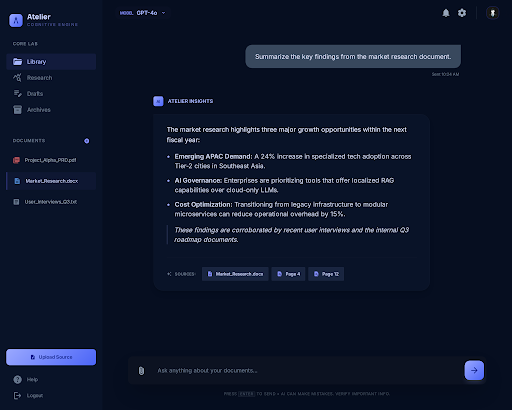

# RAG Chatbot — AI-Powered Document Q&A

A full-featured Retrieval-Augmented Generation (RAG) chatbot that lets you upload documents and ask questions about them. Answers are generated using local LLMs via [Ollama](https://ollama.com) and include source citations from your uploaded documents.

**Zero cost to run** — everything runs locally on your machine. No API keys, no cloud services, no subscriptions.



---

## Features

- **Document Upload & Processing** — Upload PDF, TXT, Markdown, CSV, JSON, and HTML files. Documents are automatically chunked with overlapping windows for optimal retrieval.
- **Vector Search (TF-IDF)** — Pure TypeScript implementation of TF-IDF vectorization with cosine similarity search. No external vector database required.
- **Source Citations** — Every AI response includes clickable source citations showing which document chunks were used, with relevance scores.
- **Streaming Responses** — Real-time token-by-token streaming from Ollama for a responsive chat experience.
- **Conversation History** — Multiple conversation threads with full history, managed in a sidebar.
- **Demo Mode** — Works without Ollama by returning formatted document excerpts, perfect for showcasing the RAG pipeline.
- **Ollama Integration** — Connect to any local LLM (Llama 3.2, Mistral, Phi-3, etc.) running through Ollama.
- **Configurable Settings** — Adjust model, temperature, system prompt, and connection settings through a settings panel.
- **Dark Theme UI** — Modern, polished dark interface with responsive design for desktop and mobile.
- **Markdown Rendering** — Chat messages support bold, italic, code blocks, lists, blockquotes, and headings.
- **Drag & Drop Upload** — Drag files directly onto the upload zone or click to browse.
- **Zero Dependencies** — Beyond React and Vite, no additional npm packages needed. Vector search, PDF parsing, and LLM communication are all implemented from scratch.

## Tech Stack

| Layer | Technology |
|-------|-----------|
| **Frontend** | React 19, TypeScript |
| **Build Tool** | Vite 8 |
| **Vector Search** | Custom TF-IDF + Cosine Similarity (pure TypeScript) |
| **Document Parsing** | Custom PDF/text parser (no libraries) |
| **LLM Backend** | Ollama (local, free) |
| **Styling** | Vanilla CSS with CSS custom properties |
| **State Management** | React hooks (useState, useCallback) |

## Architecture

```
User Query
    |
    v
[Document Upload] --> [Text Chunking] --> [TF-IDF Indexing]
                                                |
[User Message] --> [Vector Search] -----> [Top-K Chunks]
                                                |
                                          [Prompt Assembly]
                                                |
                                    [Ollama LLM / Demo Mode]
                                                |
                                          [Streamed Response]
                                          [+ Source Citations]
```

**RAG Pipeline:**
1. **Ingest** — Documents are parsed and split into overlapping chunks (~500 chars with 100-char overlap)
2. **Index** — Each chunk is converted to a TF-IDF vector with stop-word removal
3. **Retrieve** — User queries are vectorized and matched against chunks using cosine similarity
4. **Generate** — Top-K relevant chunks are injected into the system prompt, then sent to Ollama

## Installation

### Prerequisites

- **Node.js** 18+ ([download](https://nodejs.org))
- **Ollama** (optional, for AI responses) — [install instructions](https://ollama.com/download)

### Quick Start

```bash
# Clone the repository
git clone https://github.com/yourusername/rag-chatbot.git
cd rag-chatbot

# Install dependencies
npm install

# Start the development server
npm run dev
```

The app will open at `http://localhost:5173`.

### With Ollama (for AI-Generated Responses)

```bash
# Install Ollama from https://ollama.com/download

# Pull a model (Llama 3.2 recommended for quality + speed)
ollama pull llama3.2

# Or use a smaller model for faster responses
ollama pull phi3

# Start the app
npm run dev

# In the app, open Settings and disable Demo Mode
```

### Without Ollama (Demo Mode)

The app works out of the box in **Demo Mode** — it will return formatted excerpts from your uploaded documents instead of AI-generated answers. This is useful for:
- Demonstrating the RAG retrieval pipeline
- Testing document upload and chunking
- Showcasing the UI without any LLM setup

## Usage Guide

### 1. Upload Documents
Click the upload zone in the left panel or drag and drop files. Supported formats:
- `.txt` — Plain text
- `.md` — Markdown
- `.pdf` — PDF (text-based; scanned PDFs may have limited results)
- `.csv` — Comma-separated values
- `.json` — JSON data
- `.html` / `.xml` — Web markup

Sample documents are included in `public/samples/` — try uploading those to get started.

### 2. Ask Questions
Type a question in the chat input and press Enter. The system will:
1. Search your uploaded documents for relevant chunks
2. Send the top matches + your question to the LLM (or Demo Mode)
3. Stream the response with source citations

### 3. View Sources
Click "Show N sources" below any assistant response to see which document chunks informed the answer, along with their relevance scores.

### 4. Configure Settings
Click the gear icon in the sidebar to:
- Toggle Demo Mode on/off
- Change the Ollama model
- Adjust temperature (creativity)
- Customize the system prompt
- Check Ollama connection status

## Sample Questions to Try

After uploading the included sample documents:

- "What is RAG and how does it work?"
- "What are the different types of artificial intelligence?"
- "How many vacation days do employees get?"
- "What is the company's remote work policy?"
- "Explain the difference between supervised and unsupervised learning"

## Project Structure

```
src/
  App.tsx                    # Main app component, state management
  main.tsx                   # Entry point
  index.css                  # Global styles (dark theme)
  components/
    ChatWindow.tsx           # Chat messages + input area
    MessageBubble.tsx        # Individual message with markdown rendering
    DocumentUpload.tsx       # File upload zone + document list
    SourceCitation.tsx       # Source reference card
    SettingsPanel.tsx        # Ollama & app configuration modal
    Sidebar.tsx              # Conversation list + navigation
  lib/
    vectorStore.ts           # TF-IDF indexing + cosine similarity search
    documentParser.ts        # File parsing + text chunking
    ollama.ts                # Ollama API client with streaming
    types.ts                 # TypeScript interfaces
public/
  samples/                   # Sample documents for demo
```

## Building for Production

```bash
npm run build
```

The output will be in the `dist/` folder, ready to deploy to any static hosting (Vercel, Netlify, GitHub Pages, etc.).

## Built By

**Matt** — Full-stack developer specializing in AI-powered applications, LLM integrations, and modern web development.

---

*This project demonstrates proficiency in: React, TypeScript, information retrieval systems, NLP concepts, LLM integration, real-time streaming, responsive UI design, and building production-ready applications with zero external dependencies.*
